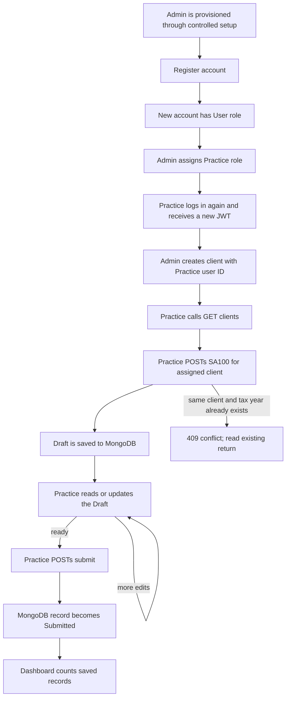

# SA100 API and workflow guide

This document describes the API as implemented in this repository: what each
route does, which role can call it, the request and response shapes, and how a
return moves from client setup to Draft to Submitted. It is a simplified
educational workflow. It does not calculate a tax liability or file a return
with HMRC.

## 1. Run and address the API

Configure a MongoDB connection string in .NET User Secrets (see the MongoDB
setup in `README.md`), then start the API. With the Development launch profile,
the HTTP base URL is usually `http://localhost:5021` and Swagger is at
`http://localhost:5021/swagger`. Use the actual URL printed by `dotnet run` if
your launch profile uses another port.

Requests and responses use JSON. The API operations use `GET` and `POST`.
Routes marked Public in the endpoint table need no JWT. Every other route
requires a JWT in this authorization header:

```http
Authorization: Bearer YOUR_JWT
```

In Swagger, click **Authorize** and enter the JWT in the format the dialog
requests. Do not include angle brackets or share your token. A JWT contains the
user ID and role from when it was issued; log in again after a role change to
get a token with the new role.

## 2. Roles and permissions

| Role | Client access | SA100 access | Dashboard |
|---|---|---|---|
| Admin | List all clients; create clients | List/read all returns | System-wide counts |
| Practice | List clients assigned to that Practice account | List/read its returns; create, edit, and submit its own drafts | Counts for its returns |
| Debitam | List clients assigned to that Debitam account | No SA100 routes | No dashboard route |
| User | No client list route | No SA100 routes | No dashboard route |

Public registration always creates the `User` role. It ignores any `role`
property sent to registration. An Admin can assign `User`, `Practice`, or
`Debitam` through the role endpoint below. The first Admin must be provisioned
through the project's controlled administrative setup; public registration
cannot make an Admin.

## 3. Complete endpoint and role matrix

Every route currently exposed by the controllers is listed here. All protected
routes require a JWT. `Authenticated` means any valid signed-in account;
role-specific access is called out explicitly.

| Method | Endpoint | Public / allowed roles | What it does |
|---|---|---|---|
| POST | `/api/auth/register` | Public | Creates a standard `User` account. |
| POST | `/api/auth/login` | Public | Checks credentials and returns a JWT and expiration time. |
| GET | `/api/auth/profile` | Authenticated | Reads the caller's profile and roles. |
| POST | `/api/auth/profile/update` | Authenticated | Updates the caller's email and/or full name. |
| POST | `/api/auth/profile/delete` | Authenticated | Deletes the caller's own account. No body. |
| POST | `/api/users/{id}/role` | Admin | Replaces a user's role with `User`, `Practice`, or `Debitam`. Cannot create an Admin. |
| GET | `/api/clients` | Admin, Practice, Debitam | Admin lists all clients; Practice and Debitam list their assigned clients. |
| POST | `/api/clients` | Admin | Creates a client assigned to a Practice user and optional Debitam user. |
| GET | `/api/sa100` | Admin, Practice | Admin lists all returns; Practice lists its own returns. |
| GET | `/api/sa100/{id}` | Admin, Practice | Reads one return; Practice must own it. |
| POST | `/api/sa100` | Practice | Creates a Draft for a client assigned to the caller. |
| POST | `/api/sa100/{id}` | Practice | Replaces the amount fields on the caller's Draft. |
| POST | `/api/sa100/{id}/submit` | Practice | Submits the caller's Draft. No body. |
| GET | `/api/dashboard` | Admin, Practice | Returns system-wide or Practice-specific SA100 counts. |
| GET | `/api/health` | Public | Returns a basic health response. |
| GET | `/WeatherForecast` | Public | Sample ASP.NET endpoint; unrelated to SA100. |

## 4. End-to-end flow

1. Register the Practice account if it does not exist.
2. An Admin assigns that account the Practice role.
3. The Practice user logs in again and receives a JWT with the Practice role.
4. An Admin creates a client and sets its `practiceUserId` to the Practice
   user's ID.
5. The Practice user lists their assigned clients and copies the client's `id`.
6. The Practice user creates one SA100 Draft for that client and tax year.
7. The Practice user can read or update the Draft, then submit it.
8. The dashboard counts persisted Draft and Submitted records for the
   appropriate role.

`clientId` in an SA100 request is the **client ID**. The Practice user's ID is
stored in the client as `practiceUserId`; it is not sent as the SA100
`clientId`.



The Admin setup / role / client steps prepare access. The Practice-owned
SA100 steps create and change returns. The dashboard reads those saved return
records; it is not a separate store.

## 5. Authentication and account setup endpoints

### Register

**POST** `/api/auth/register` — public. Creates an account with the `User`
role. A request property named `role` does not grant privileges.

```http
POST http://localhost:5021/api/auth/register
Content-Type: application/json
```

```json
{
  "username": "practice.user",
  "email": "practice@example.com",
  "password": "ReplaceWithASecret123!",
  "fullName": "Practice User"
}
```

Username must be 3–50 characters and use letters, numbers, `.`, `_`, or `-`.
Password must be 12–128 characters. Success is `201 Created` and returns the
profile, including the new user's `id` and roles.

### Login

**POST** `/api/auth/login` — public. Validates the username and password and
returns a JWT plus its expiry time.

```http
POST http://localhost:5021/api/auth/login
Content-Type: application/json
```

```json
{
  "username": "practice.user",
  "password": "ReplaceWithASecret123!"
}
```

Example response:

```json
{
  "token": "JWT_VALUE",
  "expiresAt": "2026-10-08T14:00:00Z"
}
```

Copy `token` for subsequent protected calls. Never put a real password or
token in this documentation.

### Read the current profile

**GET** `/api/auth/profile` — any authenticated user. Returns the caller's
account ID, username, email, full name, and roles. Use the `id` to identify
which Practice user a client should be assigned to.

```http
GET http://localhost:5021/api/auth/profile
Authorization: Bearer YOUR_JWT
```

### Update the current profile

**POST** `/api/auth/profile/update` — any authenticated user. Send either or
both optional profile fields. Omitted fields are unchanged; an empty
`fullName` clears it.

```json
{
  "email": "new-address@example.com",
  "fullName": "Updated Name"
}
```

### Delete the current profile

**POST** `/api/auth/profile/delete` — any authenticated user. No body. This
deletes the signed-in user account and returns `{"deleted":true}` on success.
Use carefully; this is an account deletion operation.

### Assign a user's role

**POST** `/api/users/{id}/role` — Admin only. Replaces the target user's role
list with one role. Accepted values are `User`, `Practice`, or `Debitam`
(case-insensitive); this endpoint cannot create an Admin.

```http
POST http://localhost:5021/api/users/USER_ID/role
Authorization: Bearer ADMIN_JWT
Content-Type: application/json
```

```json
{
  "role": "Practice"
}
```

Use the user ID returned by registration or profile. After a role change, that
user must log in again; a previously issued JWT retains its old role.

## 6. Client endpoints

### List visible clients

**GET** `/api/clients` — Admin, Practice, or Debitam.

```http
GET http://localhost:5021/api/clients
Authorization: Bearer YOUR_JWT
```

Admin sees all clients. Practice and Debitam see clients assigned to them.
The response is an array of client records. Copy a client's `id` for SA100
creation. An empty array means no visible clients have been created/assigned.

Example item:

```json
{
  "id": "8b32fa7d-6b58-4a6e-9fc9-05295118282f",
  "name": "Example Client",
  "nationalInsuranceNumber": "AB123456C",
  "practiceUserId": "47d40c8c-9b88-42dd-8eb9-11c3a9706732",
  "debitamUserId": null,
  "createdAt": "2026-10-08T10:00:00Z"
}
```

### Create a client

**POST** `/api/clients` — Admin only. The assigned Practice account must
already exist and have the Practice role. `debitamUserId` may be `null`; if
provided, it must identify a Debitam account.

```http
POST http://localhost:5021/api/clients
Authorization: Bearer ADMIN_JWT
Content-Type: application/json
```

```json
{
  "name": "Example Client",
  "nationalInsuranceNumber": "AB123456C",
  "practiceUserId": "47d40c8c-9b88-42dd-8eb9-11c3a9706732",
  "debitamUserId": null
}
```

The client name is required (1–100 characters), and the National Insurance
number is required (maximum 20 characters). `practiceUserId` must be a
non-empty GUID for an existing Practice user. A supplied `debitamUserId` must
identify an existing Debitam user. Success is `201 Created`; save the returned
client `id`. The service trims the name and normalizes the National Insurance
number to uppercase.

## 7. SA100 endpoints

All SA100 responses include the client and tax year, the five amount fields,
status, audit timestamps, and submitter metadata. Status is an enum serialized
as a number by the current API: `0` = Draft, `1` = Submitted.

### Create a Draft

**POST** `/api/sa100` — Practice only. The requested client must exist and its
`practiceUserId` must match the caller's JWT user ID. Client name and National
Insurance number are copied from the client record; they are deliberately not
accepted in the request body.

```http
POST http://localhost:5021/api/sa100
Authorization: Bearer PRACTICE_JWT
Content-Type: application/json
```

```json
{
  "clientId": "8b32fa7d-6b58-4a6e-9fc9-05295118282f",
  "taxYear": "2025-26",
  "employmentIncome": 42000.00,
  "selfEmploymentIncome": 0.00,
  "otherIncome": 1200.00,
  "taxAlreadyPaid": 8500.00,
  "estimatedTax": 9100.00
}
```

Tax year must be a consecutive `YYYY-YY` range (for example, `2025-26`). All
five amount fields are required and each must be between 0 and 999,999,999.99.
The API stores `estimatedTax` as supplied; it does not calculate it. Success
is `201 Created` and returns the saved record with an `id`, `status` `0`, and
null submission metadata. Save that ID as `RETURN_ID`.

The database has a unique index on `(clientId, taxYear)`: only one return for a
given client and tax year can be created. Retrying creation for that pair
returns `409 Conflict`; read the existing return instead.

### List returns

**GET** `/api/sa100` — Admin or Practice.

```http
GET http://localhost:5021/api/sa100
Authorization: Bearer YOUR_JWT
```

Admin gets all returns. Practice gets returns associated with their own
Practice user ID. An empty array means no returns are visible to that caller.

### Read one return

**GET** `/api/sa100/{id}` — Admin or Practice. Practice must own the return.

```http
GET http://localhost:5021/api/sa100/RETURN_ID
Authorization: Bearer YOUR_JWT
```

Returns `404` if the ID does not exist and `403` if a Practice user does not
own it.

### Update a Draft

**POST** `/api/sa100/{id}` — Practice only. The caller must own the return and
it must still have Draft status. Only the five monetary fields are editable;
client, tax year, and status cannot be changed here.

```http
POST http://localhost:5021/api/sa100/RETURN_ID
Authorization: Bearer PRACTICE_JWT
Content-Type: application/json
```

```json
{
  "employmentIncome": 43000.00,
  "selfEmploymentIncome": 0.00,
  "otherIncome": 1200.00,
  "taxAlreadyPaid": 8700.00,
  "estimatedTax": 9300.00
}
```

Send all five amount properties. The request is rejected with `400 Bad Request`
if any amount property is missing or outside its allowed range. Success is
`200 OK` with the updated return.

### Submit a Draft

**POST** `/api/sa100/{id}/submit` — Practice only. The caller must own the
return and it must still be Draft. Admin and Debitam cannot submit through this
route. No body is required.

```http
POST http://localhost:5021/api/sa100/RETURN_ID/submit
Authorization: Bearer PRACTICE_JWT
```

Success is `200 OK`; status becomes `1`, and `submittedBy`, `submittedAt`, and
`updatedAt` are set. A submitted return cannot be edited or submitted again.

## 8. Dashboard endpoint

**GET** `/api/dashboard` — Admin or Practice.

```http
GET http://localhost:5021/api/dashboard
Authorization: Bearer YOUR_JWT
```

Example response:

```json
{
  "totalReturns": 1,
  "draftReturns": 0,
  "submittedReturns": 1
}
```

Admin counts all saved SA100 returns. Practice counts only returns associated
with that Practice user. Counts are queried from the SA100 collection; the
dashboard does not store another copy of return data.

## 9. Other routes in this API

These routes are available but are not part of the SA100 workflow:

| Method | Endpoint | Access | Purpose |
|---|---|---|---|
| GET | `/api/health` | Public | Basic API health response. |
| GET | `/WeatherForecast` | Public | Sample ASP.NET weather endpoint. |

## 10. Error meanings

| Status | Meaning in this API |
|---|---|
| `400 Bad Request` | Invalid JSON/model validation, missing required amount, invalid role, or invalid client assignment. |
| `401 Unauthorized` | Missing/invalid/expired JWT, or login credentials rejected. |
| `403 Forbidden` | Authenticated user's role is not permitted, or Practice user does not own the client/return. |
| `404 Not Found` | Requested user, client, or return does not exist. |
| `409 Conflict` | Duplicate username; duplicate client/tax-year return; or update/submit attempted after the return stopped being a Draft. Duplicate returns have a distinct `SA100 return already exists` response. |

Check `GET /api/sa100` for the existing return before retrying creation for a
client and tax year.

## 11. Where the workflow lives in the code

- `Controllers/` defines HTTP routes and role authorization.
- `Application/DependencyInjection.cs` registers application services;
  `Infrastructure/DependencyInjection.cs` registers MongoDB, repository, and
  JWT implementations.
- `Application/SA100/` defines the SA100 use cases, enforces client ownership
  and Draft/Submitted rules, and maps domain records to response DTOs.
- `Application/Abstractions/Persistence/` defines repository contracts used by
  the application services. Infrastructure implements those contracts, so
  the application workflow does not depend on MongoDB repository classes.
- `Application/Abstractions/Security/` defines the token-generation contract;
  the JWT implementation lives in Infrastructure.
- `Application/Validation/` contains reusable request validators for tax years,
  money values, and assignable user roles.
- `Domain/SA100/` defines the stored return fields and status enum.
- `Infrastructure/Repositories/` implements persistence contracts, reads and
  writes SA100 records, and applies the atomic Draft-only update filter.
- `Infrastructure/MongoDB/MongoDbContext.cs` configures the `Users`, `Clients`,
  and `sa100_returns` collections and indexes, including the unique
  client/tax-year constraint.
- `Application/Dashboard/` counts statuses from the SA100 repository; it does
  not maintain duplicate dashboard data.
- `Tests/HMRC-TAX-FLOW.Tests/Sa100ServiceTests.cs` covers core service workflow
  rules such as client assignment, ownership, and submission.

The SA100 submit endpoint changes this application's status and records who
submitted it and when. It does not transmit the return to HMRC.
